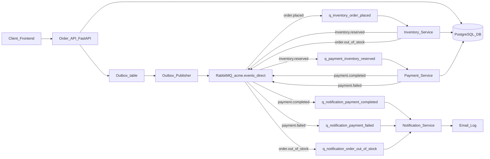

# Event-Driven Order Processing System – Design Document

This document explains the architecture, design choices, scalability considerations, and workflow of the Acme Corp e-commerce order processing system.

---

## 1. Architecture Diagram



**Flow Explanation:**

1. **Order API** receives an order and stores it in the database.
2. **Outbox Publisher** reads the outbox table and publishes `order.placed`.
3. **Inventory Service** consumes `order.placed`:
   - If stock available: decreases stock and publishes `inventory.reserved`.
   - If stock insufficient: updates order to `out_of_stock` and publishes `order.out_of_stock`.
4. **Payment Service** consumes `inventory.reserved`:
   - Simulates charging customer.
   - Publishes `payment.completed` or `payment.failed`.
5. **Notification Service** consumes `payment.*` and `order.out_of_stock` events to simulate email notifications.

---

## 2. Why Event-Driven Architecture?

### 2.1 Traditional Request/Response (Monolith)
- Services directly call each other (synchronous).
- Tightly coupled components.
- Hard to scale individual parts.
- Any failure propagates quickly.

### 2.2 Event-Driven Architecture (EDA)
- Components communicate via events asynchronously.
- Loose coupling: each service focuses on its own domain.
- Easy to add new services without touching existing code.
- Scalable and fault tolerant by design.

**Key Benefits:**
- **Scalability**: Each consumer can scale horizontally.
- **Extensibility**: New consumers subscribe to events without changing publishers.
- **Fault Isolation**: Failures in one service don’t block others.
- **Asynchronous**: Improves throughput during peaks.

**Trade-offs:**
- **Complexity**: More moving parts (brokers, queues).
- **Debugging**: Harder to trace across multiple asynchronous hops.
- **Eventual Consistency**: Data might temporarily be inconsistent until all consumers catch up.
- **Monitoring**: Requires correlation IDs and tracing for observability.

---

## 3. Loose Coupling and Extensibility

- **Exchange + Routing Keys** pattern in RabbitMQ enables multiple queues with different consumers.
- A new service (e.g. Loyalty Points) can subscribe to `payment.completed` events and award points without modifying Order API or Payment Service.
- **Outbox Pattern** ensures DB writes and event publishing are reliable and consistent.

---

## 4. Prototype Components (Code + Config)

- **Order API** (FastAPI): `POST /orders` endpoint, inserts into DB and outbox.
- **Outbox Publisher**: Reads DB and publishes events to RabbitMQ.
- **Inventory Service**: Listens to `order.placed`, updates stock.
- **Payment Service**: Listens to `inventory.reserved`, simulates payment.
- **Notification Service**: Listens to `payment.*` and `order.out_of_stock`, simulates email notifications.

**Technologies:**
- **PostgreSQL** for persistence.
- **RabbitMQ** for event bus.
- **Docker Compose** for local orchestration.

---

## 5. Testing the System

### Place an order with stock available:
```bash
curl -X POST http://localhost:8000/orders  -H "Content-Type: application/json"  -d '{"customer_id":"C100","email":"c100@example.com","items":[{"sku":"TSHIRT-BLK-M","qty":1}]}'
```

- Inventory logs show stock reserved.
- Payment logs show payment completed.
- Notification logs show confirmation email sent.

### Place an order with insufficient stock:
```bash
curl -X POST http://localhost:8000/orders  -H "Content-Type: application/json"  -d '{"customer_id":"C200","email":"c200@example.com","items":[{"sku":"TSHIRT-GRY-S","qty":999}]}'
```

- Inventory logs show out of stock.
- Notification logs show out-of-stock email sent.

---

## 6. Scaling the System (10x Load)

If orders increase 10x:
- **Horizontal Scaling**: Run multiple instances of each consumer service. RabbitMQ will distribute messages among them.
- **Prefetch/QoS Tuning**: Adjust `basic_qos(prefetch_count)` to control message flow.
- **Sharding Routing Keys**: Partition events by region/product category to different queues for parallelism.
- **Monitoring**: Add Prometheus metrics, OpenTelemetry traces, and correlation IDs to track flows.
- **Database Tuning**: Index hot columns, increase connection pools, use read replicas for reporting.

---

## 7. Database Schema (Summary)

- `orders` – order records (`id`, `customer_id`, `email`, `status`, `created_at`)
- `order_items` – order lines (`order_id`, `sku`, `qty`, `unit_price`)
- `products` – product stock (`sku`, `stock_qty`, `price`)
- `event_outbox` – events to be published (`event_type`, `payload`, `status`)
- `processed_events` – per-service idempotency record

---

## 8. Key Takeaways

- **EDA vs Monolith**: Achieves decoupling, modularity, and resilience.
- **Outbox Pattern**: Reliable event publishing tied to DB transactions.
- **Idempotent Consumers**: Prevents double processing.
- **RabbitMQ** as a backbone: Durable, persistent, supports multiple subscribers.
- **Easy Extensibility**: Add new subscribers without touching core code.

---

**Next Steps**:
- Add more subscribers (Analytics, Loyalty Points).
- Add observability (metrics/tracing).
- Deploy on Kubernetes for production-scale setup.

---
